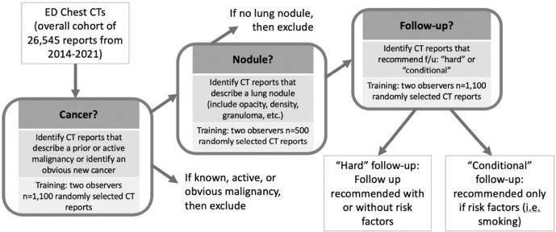
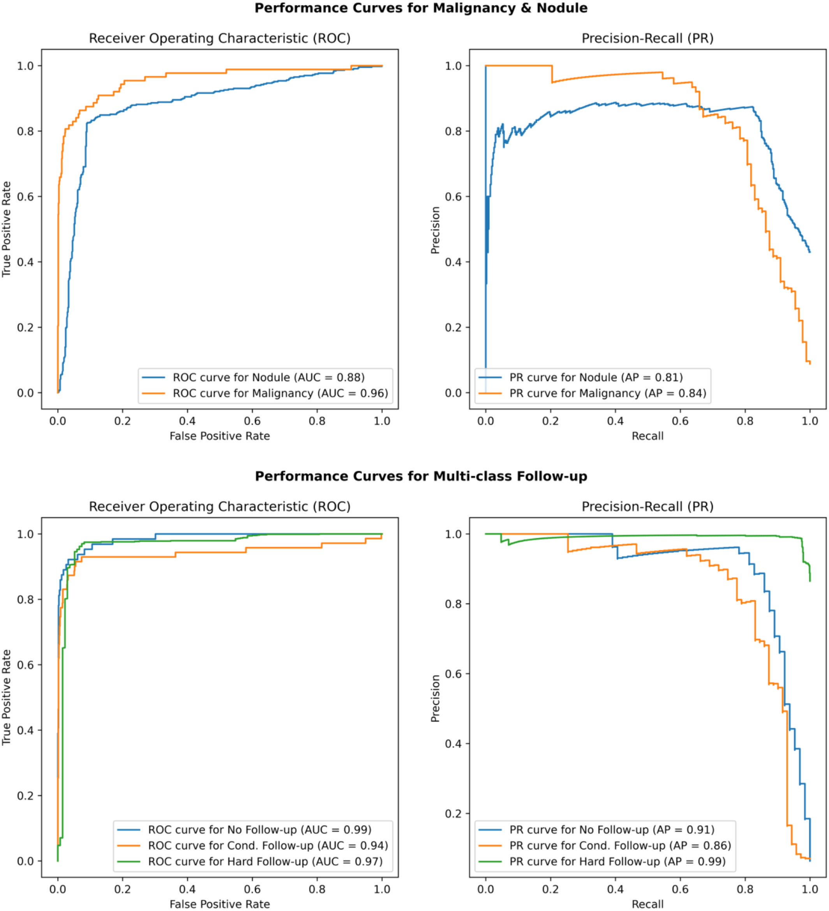
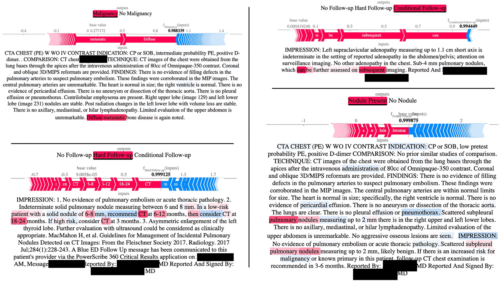

# Moore ILN Follow-up — Model Training

Training and evaluation code for the NLP system in *"Using natural language processing to identify emergency department patients with incidental lung nodules requiring follow-up"* (Moore, Socrates, et al., **Academic Emergency Medicine**, 2025; [doi:10.1111/acem.15080](https://doi.org/10.1111/acem.15080)).

The system reads free-text ED chest CT reports and flags patients with an incidental lung nodule (ILN) needing follow-up — closing the loop on findings often lost after the ED visit.

> Research / training code. The packaged, deployable app is **[moore-followup-docker](https://github.com/vsocrates/moore-followup-docker)**.

## Pipeline at a glance

A three-stage cascade, each stage an independently trained classifier:

1. **Malignancy exclusion** — drop prior, active, or obvious cancer (not *incidental*).
2. **Nodule detection** — is a lung nodule, opacity, density, or granuloma described?
3. **Follow-up categorization** — `NO`, `CONDITIONAL`, or `HARD` follow-up.

Cohort: 26,545 chest CT reports across 17,024 patients, three EDs, 2014–2021. Annotation in [Prodigy](https://prodi.gy/); training on spaCy / spacy-transformers; runs on the Yale HPC cluster via SLURM.

## Key modeling decisions

1. **Three-stage cascade, not one multiclass model.**
   - *Rationale:* each clinical sub-decision is validated and reported separately and can be retrained independently; the accepted cost is error propagation (a stage-1 miss can't be recovered downstream).

2. **RoBERTa-base + bag-of-words ensemble** (`spacy.TextCatEnsemble.v2`).
   - *Rationale:* the linear model catches templated, high-signal phrasing cheaply while RoBERTa handles negation and hedging; strided spans (window 128 / stride 96) keep recommendations from being truncated past RoBERTa's 512-token limit.

3. **Custom class-weighted loss.**
   - *Rationale:* follow-up classes are severely imbalanced (~`[1, 75, 24]`), so a standard categorizer ignores the rare HARD class; subclassing spaCy's `TextCategorizer` to weight the loss buys recall where a miss matters most, trading some majority-class precision. See `Weighted_TextCategorizer.py`.

4. **Enriched-sample fine-tuning to cut malignancy false positives.**
   - *Rationale:* initial malignancy precision was 0.70 (27 FPs / 1000); re-annotating a sequestered, enriched sample of 300 model-flagged reports and retraining raised it to 0.85 (11 FPs), so fewer true incidentals were wrongly excluded.

5. **Learning-curve-guided annotation.**
   - *Rationale:* physician labels were the scarcest resource, so curves showed where added annotations stopped paying off — directing MD time to the rarer malignancy and follow-up tasks.

## Results

Evaluated on **1,000 held-out reports** with blinded physician review and third-reviewer adjudication as the criterion standard.

**End-to-end accuracy: 93.3%** (95% CI 87.4–96.6) at the clinically meaningful task — correctly identifying patients with a nodule, no malignancy, and recommended follow-up (112 of 120).

| Stage | Precision | Recall | F1 |
|---|---|---|---|
| Malignancy exclusion | 0.85 | 0.71 | 0.77 |
| Nodule detection | 0.87 | 0.83 | 0.85 |
| Follow-up categorization | 0.82 | 0.90 | 0.85 |

Discrimination (AUROC): malignancy 0.96, nodule 0.88, no follow-up 0.99, hard follow-up 0.97, conditional follow-up 0.94. Inter-rater agreement (κ): 0.86 / 0.82 / 0.83 across the three tasks. Overall, the pipeline performs comparably or better than prior published models.

Run on all 26,545 reports: 10.1% had prior, active, or obvious malignancy; of the rest, 37.1% had a nodule, for a 12.4% overall follow-up rate.

## Interpretability

Subset of notes were evaluated for interpretability using [SHAP values over text](https://shap.readthedocs.io/en/latest/text_examples.html). 

## Repository layout

| Path | Contents |
|---|---|
| `Weighted_TextCategorizer.py` | Custom spaCy pipe with class-weighted loss |
| `run_followup_pipeline.py` | Inference: preprocess → cascade → labeled output |
| `config/` | Per-stage spaCy configs; `_bow_` and `_trf_` variants |
| `slurm_scripts/` | HPC jobs: de-identification, training, learning curves |
| `notebooks/` | Annotation prep, dev metrics, SHAP attention, iSCOUT comparison |

> Research code optimized for iteration, not a production package. The deployable artifact is the [Docker app](https://github.com/vsocrates/moore-followup-docker).

## Citation

Moore CL, Socrates V, Hesami M, Denkewicz RP, Cavallo JJ, Venkatesh AK, Taylor RA. *Using natural language processing to identify emergency department patients with incidental lung nodules requiring follow-up.* Acad Emerg Med. 2025;32(3):274–283.

## License

MIT — see [LICENSE](LICENSE).
